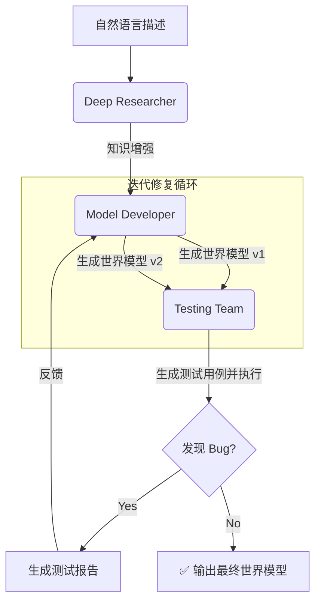

# arXiv VLA 日报

检索窗口：2025-12-27（beijing 日历日对应的 `submittedDate` 区间）。

```
((all:"vision-language-action" OR all:"vision language action" OR ti:VLA OR abs:VLA OR all:"world model" OR all:"UAV") AND (cat:cs.RO OR cat:cs.LG OR cat:cs.CV OR cat:cs.AI)) AND (submittedDate:[202512261600 TO 202512271559])
```

## Dream-VL & Dream-VLA: Open Vision-Language and Vision-Language-Action Models with Diffusion Language Model Backbone

- **arXiv**: <https://export.arxiv.org/abs/2512.22615v2>
- **ID**: `2512.22615v2`
- **分类**: cs.CV, cs.CL
- **作者**: Jiacheng Ye, Shansan Gong, Jiahui Gao, Junming Fan, Shuang Wu, Wei Bi, Haoli Bai, Lifeng Shang, Lingpeng Kong
- **标签**: VLA, 具身智能, 多传感器融合, 视频生成, 多模态, 计算机视觉
- **PDF**: [Dream-VL & Dream-VLA Open Vision-Language and Vision-Language-Action Models with Diffusion Language Model Backbone.pdf](D:/files/Obsidian/2_Research/arxiv-files/pdfs/Dream-VL & Dream-VLA Open Vision-Language and Vision-Language-Action Models with Diffusion Language Model Backbone.pdf)

好的，请坐稳。我们将一起潜入这篇论文的思想深处，体验一次从“不明觉厉”到“原来如此”的认知升级。

---

### 1. 🧭 核心锚点 (The Core Anchor)

*   **论文基本信息：**
    *   **标题：** Dream-VL & Dream-VLA: 开放的视觉-语言和视觉-语言-动作模型，以扩散语言模型为骨干
    *   **核心作者单位：** 腾讯混元、香港大学等
*   **一句话本质：**
    *   传统的机器人像个“一根筋”的学徒，你让它干活，它只能一步一步地想、一步一步地做，做第一步时完全不知道最后一步要干嘛。**这篇论文给机器人换了个“会做梦”的大脑，让它能先在脑海里模糊地“梦”到整个任务的全过程，然后再反复琢磨这个“梦境”，直到它变得清晰、连贯、可行，最后把这个完美的计划一气呵成地执行出来。**

### 2. 🚧 认知冲突与破局点 (The Cognitive Gap)

*   **行业共识与痛点：**
    *   在 Dream-VLA 之前，主流的智能机器人（或视觉语言模型）大脑，比如基于 GPT 范式的模型，都是“自回归”（Autoregressive, AR）的。这就像我们写文章，一个字一个字地往后蹦。
    *   **这带来了两个致命痛点：**
        1.  **“目光短浅”：** AR 模型在生成第 N 步动作时，只看到了前面的 N-1 步，对全局任务缺乏整体规划。这就像一个司机，只知道“下一个路口左转”，但不知道最终目的地是机场，很容易走错路或者绕远路。在机器人任务中，这会导致动作不连贯、效率低下，甚至任务失败。
        2.  **“开弓没有回头箭”：** 一旦序列中的某一步出错了，错误会像滚雪球一样被放大，因为后续的所有决策都基于这个错误的基石。想纠正？很难，你得推倒重来。

*   **核心 Insight：**
    *   作者的“灵光一现”在于，他们跳出了“一步接一步”的思维定式。他们观察到，**规划一个复杂的动作序列，本质上不是一个“续写”问题，而是一个“填空”或“修复”问题。**
    *   他们想：为什么我们不能先生成一个包含所有步骤的、但质量很差（充满“噪声”）的完整计划草稿，然后像修改文章一样，同时审视全局，反复修改、打磨，直到它完美？
    *   这个“从噪声到清晰”的过程，恰好是**扩散模型（Diffusion Model）**的看家本领。扩散模型最初是用来画画的，从一堆随机噪点中“反向扩散”出一张清晰的图片。作者的洞察是：**既然能从噪声生成图片，为什么不能从噪声生成一个完美的机器人“动作序列”呢？** 这就是思想的基石。

### 3. ⚙️ 直觉解析 (Intuitive Mechanism)

这套“做梦”大脑（Dream-VLA）的工作原理，我们可以分三步来理解：

1.  **第一步：理解任务（Perception & Understanding）**
    *   机器人通过摄像头看到当前场景（比如桌上有一个苹果和一杯水），同时听到你的指令（“把苹果放进水杯”）。
    *   系统将图像和指令编码成它能理解的“数字语言”。

2.  **第二步：做梦与构思（The "Dream" Phase - Diffusion）**
    *   **它不会立刻去想“第一步该干嘛”。**
    *   相反，它直接在脑中生成一个代表**整个任务流程**的“动作序列”的**初始草稿**。这个草稿非常粗糙，就像一个充满了雪花点的模糊视频，你可以隐约看到一个机械臂在动，但每个动作的精确坐标、速度、顺序都是混乱和不确定的（这就是“噪声”）。
    *   这个草稿包含了从开始到结束的所有时间步骤，但每个步骤都是一个“待定”状态。

3.  **第三步：梦境成真（The "Denoising" Phase - Refinement）**
    *   接下来，模型进入一个“反复推敲”的循环。它会一遍又一遍地审视这个充满噪声的完整计划。
    *   在每一轮审视中，它都会根据自己对物理世界和任务目标的理解，把整个计划变得“更合理”一点。比如：
        *   “嗯，手应该先抬起来，再伸过去，这个顺序不能错。”
        *   “这个移动轨迹太生硬了，可能会撞到杯子，我把它调整得更平滑一点。”
        *   “抓取苹果时，手爪的力度应该这样……”
    *   这个过程就像把一张模糊照片的像素点一点点对准，每一轮迭代，整个“动作视频”都变得更清晰、更连贯、更优化。它**同时**在优化第一步、第五步和最后一步，因为它看到了全局。
    *   经过若干轮迭代，一个模糊的“梦境”就变成了一个清晰、可行、高质量的**“动作块” (Action Chunk)**。

最后，机器人将这个打磨好的“动作块”一气呵成地执行出来。相比于 AR 模型走一步看一步的“抖动”，这种方式生成的动作流畅、高效且目标明确。

### 4. 💡 重要发现与反思 (Key Discoveries & Takeaways)

这篇论文的实验，不仅仅是秀肌肉，更揭示了几个深刻的规律：

*   **非共识发现 1：规划的本质是“约束求解”，而非“序列生成”。**
    *   传统观点认为，规划就是生成一个 `a1, a2, a3, ...` 的序列。这篇论文证明，一个更优的范式是：先定义一个“计划模板” `[?, ?, ?, ...]`，然后同时找到所有未知项的最佳解。扩散模型天然适合这种“全局约束求解”任务，因为它在每一步去噪时，都会考虑所有时间步之间的相互影响。

*   **非共识发现 2：“训练更快”不仅仅是效率问题，更是“架构-问题匹配度”的体现。**
    *   论文提到，Dream-VLA 在下游任务上收敛得“显著更快”。这不是一个简单的工程优化。这暗示着，对于机器人控制这类任务，**“去噪”这个学习目标，比“预测下一个词”要简单和直接得多**。模型更容易领会“一个好计划应该长什么样”，而不是在一个巨大的、开放的可能性空间里一步步探索。这说明作者找到了一个更匹配问题本质的架构。

*   **机制洞察 1：扩散模型天然地实现了“分块思考”（Action Chunking）。**
    *   人类专家干活，也是把大任务拆解成几个关键阶段，然后流畅地完成每个阶段。AR 模型很难做到这一点，因为它总是“活在当下”。而 Dream-VLA 的输出直接就是一个完整的“动作块”，这与人类的思维模式不谋而合，也更符合机器人硬件的执行逻辑。这解释了为什么它在复杂规划任务上表现优越。

*   **机制洞察 2：双向信息流是实现“深思熟虑”的关键。**
    *   AR 模型的信息流是单向的。而扩散模型的去噪过程，信息是双向流动的——后面的步骤会反过来影响前面步骤的决策（比如为了最后能精准放下物体，一开始的抓取姿态就要调整）。这种“瞻前顾后”的能力，是 AR 模型在结构上无法实现的，也是 Dream-VLA 能够做出更优规划的核心秘密。

### 5. 🧐 思想实验与批判 (Critical Thinking)

这篇论文打开了一扇大门，但我们也要冷静地审视它脚下的基石和前方的迷雾。

*   **隐藏的假设与妥协：**
    *   **致命假设 1：“世界是静态的”。** 这种“先规划、后执行”的模式，假设在执行“动作块”的期间，环境不会发生意外变化。如果在机器人执行一个精心规划的“取放”动作时，有人把杯子碰倒了，整个计划就作废了。它缺乏对**动态突发事件**的实时反应能力。
    *   **妥协 2：推理延迟。** 扩散模型需要反复迭代去噪，这个过程在推理时可能比 AR 模型生成一个 token 要慢。虽然论文声称训练收敛快，但对于需要超低延迟的实时控制场景（如高速避障），这个“深思熟虑”的过程可能会变成“反应迟钝”。它用“思考时间”换取了“规划质量”。

*   **论证的脆弱性：**
    *   论文的实验主要在**仿真环境**中进行。仿真环境是理想的、可预测的。现实世界的物理效应（摩擦力、惯性、柔性形变）、传感器噪声、执行器误差，都可能让一个在仿真中完美的计划在现实中变得一塌糊涂。从 Sim 到 Real 的巨大鸿沟，是这类方法面临的共同挑战。
    *   作者可能回避了与顶级闭源商业模型（如 Google 的 RT-X 系列）的直接比较，这使得我们对其在业界最前沿的真实地位判断有所保留。

*   **演进方向：**
    *   **下一个命题：如何将“深思熟虑”与“随机应变”结合？**
        *   一个极具价值的方向是**混合式架构**。用 Dream-VLA 这样的扩散模型生成高质量的、分阶段的**宏观计划（High-level Plan）**。然后，在执行每个宏观步骤时，用一个轻量级的、快速的 AR 模型或强化学习策略进行**微观调整（Low-level Correction）**，以应对实时变化。
        *   这就像一个团队：战略规划部门（扩散模型）负责制定季度目标，而一线销售（AR模型）则根据市场变化灵活调整自己的战术。

    *   **另一个命题：在线“重做梦”（Online Re-dreaming）。**
        *   当机器人执行计划中途遇到意外时，能否不完全抛弃原计划，而是将新的观测信息作为“强约束”，对剩余的“梦境”（计划）进行快速的“在线去噪”或“局部修复”？这将是实现真正鲁棒自主机器人的关键一步。

---

## Real-Time Quasi-Static Modeling of UAV Tether Aerodynamics

- **arXiv**: <https://export.arxiv.org/abs/2512.22588v2>
- **ID**: `2512.22588v2`
- **分类**: cs.RO
- **作者**: Max Beffert, Andreas Zell
- **标签**: VLA, 具身智能, UAV, MPC, 策略学习, 时序预测
- **PDF**: [Real-Time Quasi-Static Modeling of UAV Tether Aerodynamics.pdf](D:/files/Obsidian/2_Research/arxiv-files/pdfs/Real-Time Quasi-Static Modeling of UAV Tether Aerodynamics.pdf)

好的，作为一名资深科学家，我将为您精准拆解这篇论文。

---

### 一、 📌 论文元数据

- **标题：** Real-Time Quasi-Static Modeling of UAV Tether Aerodynamics (无人机系绳空气动力学的实时准静态建模)
- **核心机构：** University of Tübingen (德国图宾根大学)
- **一句话本质：** 提出了两种可实时的、考虑空气拖曳力的系留无人机绳索力学模型。

### 二、 🎯 破局点 (The Gap)

- **已有共识/做法：** 已有多种系绳力学模型，但实时性与精度难以兼顾。
- **核心痛点：** 现有模型要么过于简化（如忽略气动拖曳力），要么计算复杂（如全动态仿真），导致**无法用于实时在线控制**。
- **本文切入点：** 提出**“快而糙”**与**“慢而精”**两种模型互补。并利用前者的解作为后者的**初始猜测**，从而在保证精度的前提下，将“慢模型”也加速到实时水平。

### 三、 ⚙️ 核心机制 (How it works)

- **输入 -> 输出：**
  - **输入：** [无人机/基站位置, 空气速度, 系绳物理参数 (长度、重量、直径等)]
  - **输出：** [系绳的**形状**与各点**张力**]

- **关键模块 1：** **分析模型 (Analytical Model)**
  - 基于**悬链线 (catenary) 理论**，通过巧妙的坐标系旋转来等效统一的空气拖曳力，以极低的计算成本 (<1ms) 快速求解。

- **关键模块 2：** **数值模型 (Numerical Model)**
  - 将系绳离散为**质点-刚性杆**系统，使用 **CasADi** 求解力平衡非线性方程组，允许更精细的力学建模（如分段变拖曳力）。

下表总结了两种方法的权衡：

| 方法 | 核心原理 | 优点 | 缺点 | 求解速度 |
| :--- | :--- | :--- | :--- | :--- |
| **分析模型** | 悬链线理论 + 统一拖曳力假设 | **极快**、无需复杂求解器 | 假设过强、精度有限 | **< 1 ms** |
| **数值模型** | 离散化 + 非线性方程求解 | **灵活**、物理保真度高 | 计算昂贵、依赖初始值 | **~ 5 ms** (使用分析解初始化后) |

### 四、 💡 核心认知与发现 (Key Insights)

- **模型协同价值：**
  - **分析模型**的价值远不止是低成本备选方案，它更是**数值模型**实现实时性能的**关键加速器**。这种“快模型引导慢模型”的策略，是解决复杂物理仿真实时性问题的有效范式。

- **分析模型适用边界：**
  - 在大多数系留无人机典型工况下（即**垂直距离远大于水平距离**），计算成本极低的**分析模型**已具备**足够高的精度** (与数值解的 NRMSE < 1.25%)，可以直接用于资源受限的嵌入式平台。

- **数值求解关键：**
  - 对于这类非线性优化问题，**高质量的初始猜测**对求解速度的影响是**数量级**的 (本例中为 8 倍)。这比微调求解器参数本身重要得多。

### 五、 🧐 致命弱点与演进方向 (Critical Analysis)

**🛑 核心局限 (Limitations)：**

- **准静态假设：** 模型为**准静态平衡**模型，无法捕捉系绳在快速机动中的**鞭甩 (whipping)**、振动等高频动态效应。
- **二维简化验证：** 论文中的实现与验证主要在**二维平面**内进行，对于复杂的**三维空间运动**（如侧风引起的平面外摆动）的有效性未经充分证实。

**⚠️ 论证瑕疵：**

- 实验验证仅在无人机端使用了**单一的张力传感器**。这只能验证系绳一端的受力，**缺乏对系绳整体形状和张力分布的直接验证**，例如通过分布式传感或视觉重建。

**🚀 下一步高价值方向 (Next Steps)：**

- **构建实时全动态模型：** 在当前数值框架基础上，引入惯性项和阻尼项，构建能捕捉**高频动态**的**实时全动态模型**，以支持更激进的飞行任务。
- **模型嵌入闭环控制：** 将此实时模型作为核心组件，用于开发**模型预测控制 (MPC)** 或**实时风场估计**等高级在线应用，真正实现从“仿真”到“控制”的跨越。

---

## VLA-Arena: An Open-Source Framework for Benchmarking Vision-Language-Action Models

- **arXiv**: <https://export.arxiv.org/abs/2512.22539v1>
- **ID**: `2512.22539v1`
- **分类**: cs.RO, cs.CV
- **作者**: Borong Zhang, Jiahao Li, Jiachen Shen, Yishuai Cai, Yuhao Zhang, Yuanpei Chen, Juntao Dai, Jiaming Ji, Yaodong Yang
- **标签**: VLA, 具身智能, 评测基准, 多模态, 机器人, 计算机视觉
- **PDF**: [VLA-Arena An Open-Source Framework for Benchmarking Vision-Language-Action Models.pdf](D:/files/Obsidian/2_Research/arxiv-files/pdfs/VLA-Arena An Open-Source Framework for Benchmarking Vision-Language-Action Models.pdf)

好的，请坐稳。我们不只是要读懂这篇论文，而是要借助它，完成一次对具身智能（Embodied AI）研究范式的认知升级。

这篇论文表面上是发布一个「测试工具」，但它的真正价值在于提供了一套「思想钢印」，彻底改变了我们衡量和理解机器人智能的方式。

---

### 1. 🧭 核心锚点 (The Core Anchor)

*   **论文基本信息：**
    *   **标题：** VLA-Arena: 一个用于基准测试视觉-语言-动作模型的开源框架
    *   **核心作者团队：** Borong Zhang, Yaodong Yang 等，来自北京大学、上海人工智能实验室等顶尖研究机构。

*   **一句话本质：**
    *   这篇论文创造了一个**机器人「精细化体检中心」**。过去的测试就像是简单地问病人“你感觉怎么样？”，而这个体检中心则通过**独立的「视力测试」、「听力（语言理解）测试」和「肢体协调性测试」**，精准诊断出机器人大脑（VLA模型）到底是在“看”上、“听”上，还是“做”上出了问题。

---

### 2. 🚧 认知冲突与破局点 (The Cognitive Gap)

*   **行业共识与痛点：**
    *   在 VLA-Arena 之前，我们评估一个机器人模型，就像看一场大混战。我们给机器人一堆任务，然后统计成功率，比如 75%。这个数字很诱人，让我们产生一种“模型越来越强”的**工程假象**。
    *   **但这里的卡脖子问题是：** 对于那失败的 25%，我们一无所知。机器人是没看清物体（视觉问题）？没听懂指令（语言问题）？还是任务太复杂，它不知道该先做什么后做什么（规划问题）？我们得到的是一个**模糊的、不可归因的“总分”**，这对于真正改进模型毫无帮助，就像医生只知道病人“不舒服”，却不知道病灶在哪。

*   **核心 Insight (灵光一现)：**
    *   作者的破局点在于一个极其清晰且强大的思想：**正交分解（Orthogonal Decomposition）**。
    *   他们意识到，问题的“难度”不是一个单一维度。一个任务的困难，可能来自三个**相互独立（正交）**的源头：
        1.  **任务结构本身**的复杂性（比如需要长序列动作，或避开障碍）。
        2.  **语言指令**的模糊或刁钻。
        3.  **视觉环境**的干扰或变化。
    *   这个思想的基石是：**要想看清一个东西，就必须把它从一团乱麻中单独拎出来。** 与其创造一个“更难”的混合任务，不如保持其他所有条件不变，只在一个维度上增加难度。这，就是从混沌走向科学的决定性一步。

---

### 3. ⚙️ 直觉解析 (Intuitive Mechanism)

这套框架的运转方式，就像一个精密设计的实验流程：

1.  **第一步：建立“健康基线” (L0 训练)**
    *   首先，他们只教机器人做最简单、最标准的一系列动作（170个 L0 级任务），比如“拿起桌上的苹果”。这相当于给机器人一个“大学本科”水平的基础教育，确保它掌握了基本技能。

2.  **第二步：进行“专项压力测试” (三个独立旋钮)**
    *   现在，精彩的部分来了。他们开始像调音师一样，拧动三个独立的“难度旋钮”，但**每次只拧一个**：
        *   **旋钮A：任务逻辑复杂度 (Task Structure)**
            *   **安全测试：** “拿起苹果，但绝对不要碰到旁边的水杯。” —— 测试模型是否理解约束。
            *   **干扰测试：** “拿起红色的积木。”（桌上有一堆红色、形状各异的玩具）—— 测试模型的目标识别精度。
            *   **泛化测试：** “把苹果放到比你训练时见过的任何位置都更远的地方。” —— 测试模型的行为外推能力。
            *   **长程测试：** “先拿起苹果，再拿起香蕉，然后把它们都放进篮子里。” —— 测试模型的长序列规划与记忆能力。
            *   **关键点：** 在做这些测试时，语言指令和视觉环境都保持最简单，确保失败只因任务逻辑。

        *   **旋钮B：语言理解力 (Language Command)**
            *   他们回到最简单的“拿起苹果”任务，但换一种说法：“可以帮我把那个红色的水果拿过来吗？”或者“桌上那个能吃的、圆圆的东西，递给我。” —— 测试模型的语言鲁棒性。
            *   **关键点：** 任务和视觉不变，只改变说法。如果模型失败了，那百分之百是“听力”出了问题。

        *   **旋钮C：视觉鲁棒性 (Visual Observation)**
            *   同样是“拿起苹果”这个简单任务，他们开始“作妖”：把灯光调暗、更换摄像头角度、在桌面上制造反光、或者用其他物体部分遮挡苹果。
            *   **关键点：** 任务和指令不变，只改变视觉输入。如果模型失败，那就是“视力”不行。

通过这种“控制变量”的精妙设计，VLA-Arena 实现了对模型能力的**“CT扫描”**，清晰地揭示了病灶所在。

---

### 4. 💡 重要发现与反思 (Key Discoveries & Takeaways)

这部分是论文的灵魂，它揭示的不是“谁跑分高”，而是整个行业都可能走偏了的方向。

*   **非共识发现 1：当前的SOTA模型是“应试高手”，而非“通才学者”。**
    *   **现象：** 模型在训练过的 L0 任务上表现完美，但只要稍微增加一点点难度（L1/L2），性能就断崖式下跌。
    *   **机制洞察：** 这无情地揭示了，模型学到的不是“抓取物体”这个**通用物理规律**，而是“在A场景下听到B指令就执行C动作”的**脆弱的统计映射**。它们在“记忆”而非“理解”。这对鼓吹“大力出奇迹”、认为模型越大就越能泛化的观点是沉重一击。

*   **非共识发现 2：模型的“感官”发育极不均衡（非对称鲁棒性）。**
    *   **现象：** 一个模型可能对视觉变化（比如光照）不那么敏感，但只要你把指令换个同义词，它就立刻“瘫痪”；反之亦然。
    *   **机制洞察：** 这说明模型的视觉、语言和动作模块远未实现真正的“融合”。它们更像是一个被强行捆绑在一起的草台班子，而非一个协调一致的有机体。我们不能再把 VLA 模型看作一个铁板一块的“黑箱”，它的内部存在着严重的“能力偏科”。

*   **非共识发现 3：安全和组合能力不是“涌现”出来的，而是需要被“设计”的。**
    *   **现象：**
        1.  **安全：** 模型为了完成“拿苹果”的目标，会毫不犹豫地撞翻“禁止触碰”的水杯。它没有“不做什么”的概念。
        2.  **组合：** 学会了“开门”和“拿东西”的模型，并不会自动懂得“开门后进去拿东西”。
    *   **机制洞察：** 这两个发现直击了具身智能的要害。
        1.  **安全不是默认项。** 模型的优化目标是完成任务，任何阻碍物都是需要被“克服”的，而不是需要被“遵守”的。这说明基于奖励的训练机制存在根本缺陷，无法内生地产生安全意识。
        2.  **技能的“组合性”是当前模型最大的谎言。** 我们以为模型学会了A和B，就能组合出A+B，但实验证明它们不能。这说明模型学到的是僵化的、端到端的“过程记忆”，而不是可供灵活调用的、模块化的“原子技能”。这使得构建能处理无限真实世界任务的通用机器人变得遥遥无期。

---

### 5. 🧐 思想实验与批判 (Critical Thinking)

这篇论文的思想框架非常强大，但作为资深科学家，我们必须看到它的边界和前提。

*   **隐藏的假设与妥协：**
    *   **仿真的“无菌环境”：** 这一切都发生在仿真世界。这里的物理是简化的，交互是完美的。真实的厨房里，一个油腻的、略带弧度的盘子，其抓取难度是仿真环境无法复现的。**VLA-Arena 诊断出的“病”，可能只是真实世界并发症中的一小部分。** 从这个“体检中心”健康毕业的机器人，在真实世界可能依然“活不过第一集”。
    *   **“正交”是理想，“耦合”是现实：** 论文的核心是“正交分解”，这在实验设计上是天才之举。但在真实世界，难度往往是耦合的。一个“长程任务”（任务复杂）往往伴随着含糊的指令“把这里收拾干净”（语言复杂）和混乱的环境（视觉复杂）。VLA-Arena 能诊断“单点故障”，但对这种“多器官并发衰竭”的诊断能力是有限的。

*   **论证的脆弱性：**
    *   **作者定义的“难度”是否是唯一的标准？** 他们将任务难度划分为安全、干扰、外推、长程四个维度，这非常精彩。但真实世界的难度维度可能远不止于此，比如对工具的使用、对人类意图的猜测、对不确定性的处理等。这个框架虽然优秀，但并非完备。

*   **演进方向 (下一个真正有价值的命题)：**
    1.  **从“诊断”到“治疗”：** VLA-Arena 开出了一份清晰的“诊断报告”（模型缺乏组合性、安全意识等）。那么，**下一个圣杯级的问题是：如何设计新的模型架构或训练范式来专门“治疗”这些“疾病”？** 例如，我们是否需要引入符号逻辑来增强组合性？或者引入因果推理来理解安全约束？
    2.  **迈向“真实世界的体检中心”：** 如何将 VLA-Arena 的思想精髓，从仿真环境迁移到真实的物理世界？建立一个可复现、可量化、可控制变量的**真实机器人测试平台**，将是推动领域发展的下一个巨大工程。
    3.  **研究“耦合难度”：** 在正交分解之后，下一步就是研究**难度的“交叉项”**。当视觉干扰和语言模糊同时出现时，模型的性能是如何衰减的？是线性叠加，还是指数崩溃？理解这种耦合效应，才能让我们为更复杂的真实场景做好准备。

总而言之，VLA-Arena 的价值不在于它测试了几个模型，而在于它提供了一把**思想上的“手术刀”**，让我们第一次能够以前所未有的精度，去解剖和理解机器人智能的内在结构、缺陷与潜能。它标志着具身智能研究从“炼丹式”的整体评估，迈向了“诊断式”的科学分析新时代。

---

## Clutter-Resistant Vision-Language-Action Models through Object-Centric and Geometry Grounding

- **arXiv**: <https://export.arxiv.org/abs/2512.22519v1>
- **ID**: `2512.22519v1`
- **分类**: cs.RO
- **作者**: Khoa Vo, Taisei Hanyu, Yuki Ikebe, Trong Thang Pham, Nhat Chung, Minh Nhat Vu, Duy Nguyen Ho Minh, Anh Nguyen, Anthony Gunderman, Chase Rainwater, Ngan Le
- **标签**: VLA, 具身智能, 三维表征, 策略学习, 多模态, 机器人
- **PDF**: [Clutter-Resistant Vision-Language-Action Models through Object-Centric and Geometry Grounding.pdf](D:/files/Obsidian/2_Research/arxiv-files/pdfs/Clutter-Resistant Vision-Language-Action Models through Object-Centric and Geometry Grounding.pdf)

好的，作为一名顶尖学术研究员，我已经完成了对该论文的深度剖析。以下是为您提取的核心信息与洞察。

---

### 一、 📌 论文元数据

- **标题：** Clutter-Resistant Vision-Language-Action Models through Object-Centric and Geometry Grounding (通过以物体为中心和几何接地实现抗干扰的视觉-语言-动作模型)
- **核心机构：** University of Arkansas (阿肯色大学)
- **一句话本质：** 通过**解耦感知与动作**，先过滤场景再执行决策，大幅提升了机器人在杂乱环境中的抓取鲁棒性。

### 二、 🎯 破局点 (The Gap)

- **已有共识/做法：** 主流的 **VLA (视觉-语言-动作) 模型**将感知和控制耦合在单一的端到端网络中进行训练。
- **核心痛点：** 端到端训练导致模型的**语言-视觉对齐能力退化**，在面对干扰物、背景变化时极易出错，甚至在目标不存在时也会“过度抓取”。
- **本文切入点：** 作者的直觉是**显式解耦感知与动作**。先用一个独立的感知模块“净化”视觉输入，只保留任务相关物体，再将“干净”的视图送给VLA模型进行动作决策。

### 三、 ⚙️ 核心机制 (How it works)

- **输入 -> 输出：**
  （语言指令 + 原始多视角RGB图像） -> **感知接地模块** -> （净化的、仅含目标的几何视图） -> **VLA策略模型** -> 机器人动作序列

- **关键模块 1：** **物体为中心的语义接地 (Object-Centric Grounding)** - 利用VLM（如Qwen3-VL）和视觉提示（Set-of-Mark），在多视角图像中**定位**与语言指令匹配的任务相关物体区域。

- **关键模块 2：** **几何接地 (Geometric Grounding)** - 将识别出的物体区域从RGB**转换**为深度图，强调其**3D结构**而非表面外观，生成最终喂给策略模型的“净化”视图。

### 四、 💡 核心认知与发现 (Key Insights) 🌟重点

- **[范式转变]：** **感知与动作解耦**是提升VLA鲁棒性的关键。将感知作为独立模块，能有效防止VLA模型在微调中损失其**视觉语言对齐能力**，从而大幅提升在复杂场景下的可靠性。

- **[数据效率]：** 通过前端的感知净化，VLA策略模型**只需在“干净”的单物体数据上微调**，即可泛化到部署时的“杂乱”场景。这极大降低了对大规模、多样化杂乱场景演示数据的依赖。

- **[表征选择]：** 相比于物体的颜色、纹理等外观信息，其**三维几何结构（通过深度图表达）是更稳定、更利于泛化的表征**。这使得模型在面对背景变化或前所未见的新物体时表现更佳。

### 五、 🧐 致命弱点与演进方向 (Critical Analysis)

**🛑 核心局限 (Limitations)：**

- **[级联误差]：** 整个框架的性能**强依赖于上游感知模块**（分割、VLM、深度估计）的准确性。任意一个环节出错，都可能导致整个任务失败。
- **[推理延迟]：** 模块化的设计和对大型VLM的调用带来了**显著的计算开销**，导致控制频率较低（约1Hz），不适用于需要快速响应的动态任务。

**⚠️ 论证瑕疵：**

- **实验缺乏对VLM能力的消融分析**。论文强依赖于强大的Qwen3-VL进行语义接地，但未探讨使用更小或能力稍弱的VLM对系统性能的影响，使得框架的普适性论证不够充分。

**🚀 下一步高价值方向 (Next Steps)：**

- **[模型融合与蒸馏]：** 将独立的感知模块的能力**蒸馏（distill）或摊销（amortize）**到一个更轻量、更高效的单一网络中，在保持鲁棒性的同时解决推理延迟问题，实现端到端的实时控制。
- **[任务复杂度扩展]：** 将该框架从简单的“抓取-放置”任务扩展到**长时程、多步骤的复杂动态任务**，例如与抽屉、瓶盖等可活动部件进行交互。

---

## Emergence of Human to Robot Transfer in Vision-Language-Action Models

- **arXiv**: <https://export.arxiv.org/abs/2512.22414v1>
- **ID**: `2512.22414v1`
- **分类**: cs.RO, cs.AI
- **作者**: Simar Kareer, Karl Pertsch, James Darpinian, Judy Hoffman, Danfei Xu, Sergey Levine, Chelsea Finn, Suraj Nair
- **标签**: VLA, 具身智能, 策略学习, 多模态, 机器人, 人工智能
- **PDF**: [Emergence of Human to Robot Transfer in Vision-Language-Action Models.pdf](D:/files/Obsidian/2_Research/arxiv-files/pdfs/Emergence of Human to Robot Transfer in Vision-Language-Action Models.pdf)

好的，作为一位资深科学家，我将为您拆解这篇论文。

---

### 一、 📌 论文元数据

-   **标题：** Emergence of Human to Robot Transfer in Vision-Language-Action Models (视觉-语言-动作模型中人-机迁移能力的涌现)
-   **核心机构：** Physical Intelligence, Georgia Institute of Technology
-   **一句话本质：** 机器人从人类视频中学习的能力，会随着模型预训练数据**多样性的增加**而**涌现**。

### 二、 🎯 破局点 (The Gap)

-   **已有共识/做法：** 使用人类视频训练机器人，但通常需要复杂的、人工设计的**对齐方法**。
-   **核心痛点：** 人工对齐方法**工程量大**、**通用性差**，难以扩展到大规模、多样化的人类视频。
-   **本文切入点：** 作者猜想，只要**预训练规模和多样性**足够大，模型或许能**自动学会对齐**，无需人工干预，从而实现简单的技能迁移。

### 三、 ⚙️ 核心机制 (How it works)

-   **输入 -> 输出：** （人类/机器人）多视角视频 + 语言指令 -> 机器人**离散动作序列** + **连续动作轨迹**。

-   **关键模块 1：** **多样化预训练 (Diverse Pre-training)** - 在海量、多场景、多任务、多形态的**机器人数据**上预训练一个 VLA 模型。这是产生涌现能力的基础。

-   **关键模块 2：** **简单联合微调 (Simple Co-finetuning)** - 将少量**人类视频数据**（标注了动作和子任务）与相关的机器人数据混合，用完全相同的目标函数进行微调，**不进行任何特殊对齐**。

### 四、 💡 核心认知与发现 (Key Insights)

-   **能力涌现 (Emergence):**
    **人-机技能迁移**不是一个线性提升的过程，而是一种**涌现能力**。只有当 VLA 模型的预训练数据多样性（场景、任务、机器人形态）**跨过一个临界点**后，模型才能有效利用人类视频数据。

-   **表征对齐 (Representation Alignment):**
    技能迁移的根本原因在于，大规模多样化预训练促使模型学习到了**“形态无关”的表征 (embodiment-agnostic representations)**。模型能将人类和机器人的相似动作映射到潜空间中的邻近区域，从而**自动完成对齐**。

-   **数据等效性 (Data Equivalence):**
    在足够强大的预训练模型基础上，**人类视频数据**在提升新任务性能上的价值，几乎可以**媲美用另一款机器人收集的数据**（跨机器人形态迁移）。这证明了将人类视为“另一种机器人形态”的可行性。

### 五、 🧐 致命弱点与演进方向 (Critical Analysis)

**🛑 核心局限 (Limitations)：**

-   **数据收集约束：** 目前的人类数据仍是**“模仿机器人”的片段式采集**（episodic），而非真实世界中连续、被动的日常行为数据，这限制了数据的规模和真实性。
-   **模型依赖性：** 该方法的成功**强依赖于一个已有的、超大规模预训练的 VLA 模型**。对于从零开始或数据不足的场景，此方法可能无效。

**⚠️ 论证瑕疵：**

-   论文对“多样性”的量化不够精确，主要通过**增加 [场景-任务] 组合的百分比**来控制。缺乏对多样性不同维度（如物体、光照、动态性）影响的独立分析。

**🚀 下一步高价值方向 (Next Steps)：**

-   **被动数据预训练：** 如何将此框架扩展到**无动作标签的、海量的被动人类视频**（如 YouTube、Ego4D）上，用于模型的**预训练阶段**，而非仅仅是微调。
-   **涌现能力的边界：** 持续扩大预训练规模，**还能涌现出哪些新能力**？例如，零样本工具使用、物理常识推理等。

---

## Agent2World: Learning to Generate Symbolic World Models via Adaptive Multi-Agent Feedback

- **arXiv**: <https://export.arxiv.org/abs/2512.22336v1>
- **ID**: `2512.22336v1`
- **分类**: cs.AI, cs.CL
- **作者**: Mengkang Hu, Bowei Xia, Yuran Wu, Ailing Yu, Yude Zou, Qiguang Chen, Shijian Wang, Jiarui Jin, Kexin Li, Wenxiang Jiao, Yuan Lu, Ping Luo
- **标签**: VLA, 具身智能, 世界模型, 策略学习, 人工智能, 自然语言
- **PDF**: [Agent2World Learning to Generate Symbolic World Models via Adaptive Multi-Agent Feedback.pdf](D:/files/Obsidian/2_Research/arxiv-files/pdfs/Agent2World Learning to Generate Symbolic World Models via Adaptive Multi-Agent Feedback.pdf)

好的，作为一名顶尖的学术研究员，我已完成对论文《Agent2World》的深度拆解。以下是为您提取的核心信息与洞察。

---

### 一、 📌 论文元数据

- **标题：** Agent2World: 通过自适应多智能体反馈学习生成符号世界模型
- **核心机构：** 香港大学 (The University of Hong Kong)
- **一句话本质：** 通过模拟软件开发的「开发-测试」多智能体协作，让大模型自主生成并修复符号世界模型，同时将该过程转化为高质量训练数据。

### 二、 🎯 破局点 (The Gap)

- **已有共识/做法：** 使用大语言模型（LLM）从自然语言直接生成符号世界模型（如 PDDL 或可执行代码）。
- **核心痛点：** 依赖**静态验证**（如语法检查器、固定测试用例），无法捕捉在**交互式执行**中才会暴露的**行为级错误**（如状态更新不一致）。
- **本文切入点：** 模拟人类软件开发流程，引入一个专门的**「测试团队」智能体**，通过**动态、自适应的执行测试**来发现深层错误，并提供结构化反馈，从而打破静态验证的局限。

### 三、 ⚙️ 核心机制 (How it works)

- **输入 -> 输出：** 自然语言描述 -> **可执行的符号世界模型** (PDDL 或 Python 代码)

- **关键模块 1：** **Deep Researcher (深度研究员)** - 通过网络搜索补全任务描述中缺失的常识或背景知识，解决信息不完备问题。

- **关键模块 2：** **Model Developer (模型开发者)** - 负责根据完善后的描述，编写世界模型的初始代码实现。

- **关键模块 3：** **Testing Team (测试团队)** - 动态生成并执行**单元测试**和**模拟测试**，从行为层面验证模型的正确性，并生成详细的**测试报告 (Test Report)** 反馈给开发者进行迭代修复。

**极简逻辑流：**



### 四、 💡 核心认知与发现 (Key Insights) 🌟重点

- **[架构有效性]：** **专业分工的多智能体架构**显著优于单一通用智能体。消融实验表明，移除任何一个专业角色（研究员、开发者、测试员）都会导致性能大幅下降，证明了模拟人类团队协作模式（知识搜集、开发、测试）在复杂代码生成任务中的必要性。

- **[反馈机制]：** **动态、基于执行的反馈**是发现深层逻辑错误的关键。与静态语法检查不同，**自适应测试**（Adaptive Testing）能暴露模型在实际运行时的**动态不一致性**（如物理规律违背、目标不可达）。错误分析显示，迭代过程使错误类型从初期的**语法、接口错误**转变为后期的**核心动态逻辑错误**。

- **[数据飞轮]：** **智能体交互过程本身就是高质量的训练数据**。`开发者`与`测试团队`之间的多轮修复对话，构成了一个**「问题-代码-反馈-修复」**的完整轨迹。通过**验证器引导的拒绝采样**（Verifier-Guided Rejection Sampling）筛选出成功的交互轨迹，可形成一个强大的数据引擎，用于微调（SFT）模型，使其学会如何利用执行反馈进行自我修正。

### 五、 🧐 致命弱点与演进方向 (Critical Analysis)

**🛑 核心局限 (Limitations)：**

- **高昂的计算成本：** 多智能体、多轮次的交互和测试循环，尤其是在线执行代码，导致**Token 消耗和时间成本**远高于单次生成方法。这是一种**一次性合成成本**换取**永久模型质量**的权衡。
- **测试能力的瓶颈：** 框架的上限取决于 **`Testing Team`** 的能力。对于极其复杂或开放世界的模拟，自动生成全面、深刻的测试用例本身就是一个巨大挑战，可能成为系统的**性能瓶颈**。

**⚠️ 论证瑕疵：**

- 在 `ByteSized32` 基准测试中，使用了 **GPT-4o 作为自动化评估器**。这引入了评估的**不确定性**，因为评估结果依赖于另一个 LLM 的判断，而非完全客观、确定性的指标，可能存在评估偏见。

**🚀 下一步高价值方向 (Next Steps)：**

- **自进化的测试智能体 (Self-Improving Testers)：** 让 `Testing Team` 不仅能生成测试，还能从多次任务的失败模式中**学习和归纳**，从而进化出更高效、更具洞察力的**测试策略**，形成开发与测试能力的协同进化。
- **混合世界模型生成 (Hybrid World Model Generation)：** 将此框架从纯符号模型扩展到**神经-符号混合世界模型**的生成。这意味着 `Testing Team` 需要进化出能够同时验证**符号规则的逻辑自洽性**和**神经网络模块的预测准确性**的混合测试能力。

---

